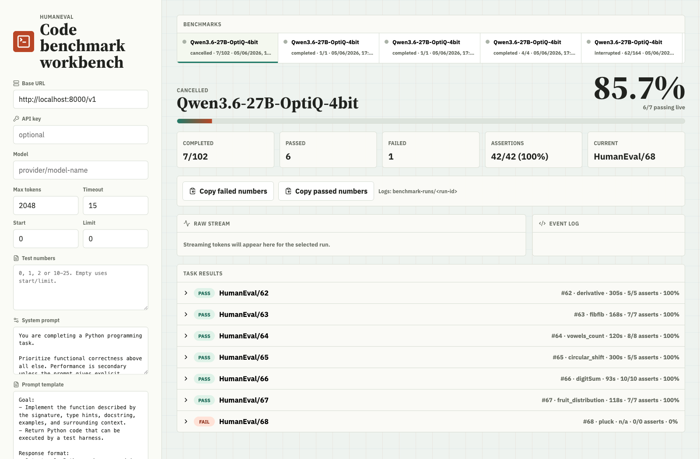

# HumanEval Runner

A local web workbench for running the OpenAI HumanEval benchmark against any
OpenAI-compatible `/v1/chat/completions` endpoint.

The core workflow is simple: point the app at a model endpoint, edit the system
prompt or user prompt template, start a subset or full HumanEval run, and watch
live pass/fail results stream in as each task completes.



## Features

- React/Vite GUI for configuring benchmark runs.
- OpenAI-compatible streaming chat completions support.
- Editable system prompt and HumanEval prompt template.
- Full HumanEval runs or targeted task lists such as `0, 1, 2` or `10-25`.
- Configurable pass count for rerunning the selected benchmark set multiple
  times in pass-major order.
- Configurable task parallelism, defaulting to one task at a time.
- Live pass@1 score, completed/passed/failed counts, and assertion-level stats.
- Per-task views for prompt, original task, model output, extracted code,
  captured reasoning/thinking stream, tests, traceback, and assertion ledger.
- Copy buttons for failed or passed task numbers so you can rerun focused sets.
- Server-side runs continue if the browser reloads; the UI can reconnect to
  active or historical runs.
- Incomplete stopped, cancelled, interrupted, or errored runs can be resumed
  from their existing saved results.

## Quick Start

Requirements:

- Node.js 20 or newer.
- Python 3 available as `python3`.
- A local or remote OpenAI-compatible chat completions endpoint.

Install dependencies:

```bash
npm install
```

Start the benchmark API server:

```bash
npm run dev:bench
```

In another terminal, start the web UI:

```bash
npm run dev
```

Open:

```text
http://localhost:5173
```

The benchmark server listens on `http://localhost:8787` by default. Override it
with `HUMANEVAL_PORT` if needed:

```bash
HUMANEVAL_PORT=8788 npm run dev:bench
```

## Performance Measurement

The app includes debug-only performance instrumentation for diagnosing browser
memory pressure before changing benchmark behavior. Enable it with
`?debug=performance` in the browser and `HUMANEVAL_PERFORMANCE_LOG=1` on the
benchmark server.

See [docs/performance-measurements.md](docs/performance-measurements.md) for the
measurement workflow, available counters, server log fields, and the intended
evidence-first optimization process.

## Running Benchmarks

Use `Limit = 0` to run all 164 HumanEval problems. To run a subset, either set
`Start` and `Limit`, or enter explicit `Test numbers` such as:

```text
0, 1, 2
10-25
HumanEval/0 HumanEval/42
```

The prompt template must include `%problem_code%`; that marker is replaced with
the HumanEval function stub for each task.

Set `Parallel` to the number of HumanEval tasks to solve at once. The default is
`1`, which preserves sequential execution. Higher values send multiple model
requests concurrently and can make runs faster if your endpoint supports it.

Set `Passes` to rerun the same selected benchmark set multiple times. The runner
executes the whole task set for pass 1, then the whole task set for pass 2, and
so on. Results are grouped by HumanEval task in the UI, with pass tabs inside
each task row.

Use `Stop selected` to cancel an active run. If the run is incomplete, select it
again and use `Resume` to continue only the attempts that do not already have
saved results.

The `Extra request body` field accepts a JSON object and is merged into the
chat completion request. For example:

```json
{
  "top_p": 1
}
```

## Run Artifacts

Runs are written under `benchmark-runs/<started-at>-<model>-<run-id>/`, with
the timestamp first so folders sort by start time:

- `run.json` contains the run summary and public configuration.
- `results.json` contains task results, extracted code, prompts, harness output,
  model output, usage, and assertion details.
- `task-logs.jsonl` contains aggregate per-task log entries.

`benchmark-runs/` is ignored by git because it can contain private prompts,
model output, endpoint details, and reasoning/thinking traces.

The HumanEval dataset is downloaded on demand into `.cache/`, which is also
ignored by git.

### Reprocess saved output

To preview how current output-only extraction changes saved runs without
modifying them:

```bash
npm run reanalyze:output-extraction -- --no-execute
```

To re-extract changed candidates from `rawOutput`, rerun their HumanEval tests,
and update saved run summaries, results, task logs, and events:

```bash
npm run migrate:output-extraction
```

The migration preserves explicit model-request errors, creates timestamped
backups under `benchmark-runs/.migration-backups/`, writes atomically, and is
safe to rerun. Stop the benchmark API server before migrating, then restart it
afterward; an already-running server keeps historical runs in memory and will
not see migrated artifacts until restart.

## Safety

HumanEval evaluates model-generated Python locally. This runner uses temporary
directories, timeouts, and a lightweight reliability guard, but it is not a
hardened sandbox. Run untrusted models or prompts inside a dedicated OS user,
container, VM, or other sandbox.

Do not commit benchmark outputs unless you have reviewed them. They may contain
API endpoint details, model identifiers, prompt text, model completions, and
reasoning/thinking traces.

The API key entered in the UI is sent to the local benchmark server for outbound
requests. Saved run config stores `"***"` when a key was provided and `""` when
it was empty; the plain text key is not written to `run.json` or `results.json`.

## Build

```bash
npm run build
```

Preview the production build:

```bash
npm run preview
```

## Disclaimer

This project was vibe coded with Codex GPT-5.5 Medium. Review the code, security
model, and benchmark methodology before relying on results.
